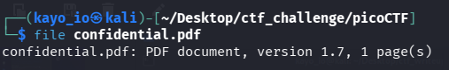
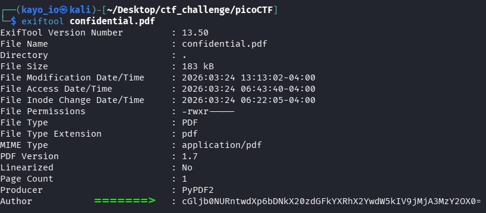
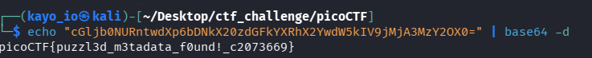

# PicoCTF - PDF Metadata Challenge

## Description
I was given a PDF file with hints suggesting that the flag might be hidden somewhere in the document, possibly not visible directly.

---

## Initial Observation

The PDF contained:
- Normal-looking text  
- Redacted (blacked-out) sections  
- Hints like:  
- "maybe something is hidden somewhere"  
- "the answer might not be here"  

This suggested that the flag was not in the visible content.

---

## Approach

### Step 1: Check File Type

**Result**: The file type was PDF.

### Step 2: Metadata Search

Since PDFs often contain hidden metadata, I used ExifTool to extract the file properties:

**Result**: In the metadata output, I found the **Base64** text hidden in the Author field:

### Step 3: Decoding The string

I finally Decoded the text(base64):

**Discovery**

>The Flag:"picoCTF{puzzl3d\_m3tadata\_f0und!_c2073669}" 

#### Lessons Learned

* Always check metadata in files (especially PDFs, images, etc.) as it can contain hidden or sensitive information.

* Tools like ExifTool are essential for forensics challenges.

* If the string is ended with "==" its **base64**

#### Tools used:
 
* exiftool - to see the metadata  
* base64 - to decode base64 text
