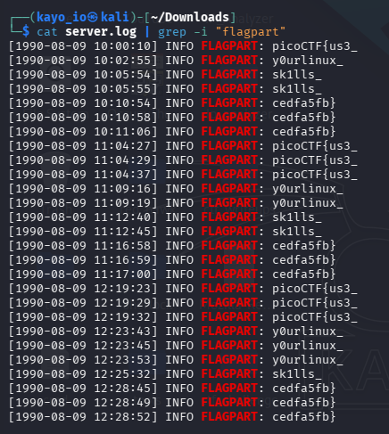
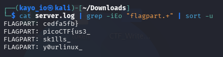

# PicoCTF - Log Hunt

## Description
server seems to be leaking pieces of a secret flag in its logs. The parts are scattered and sometimes repeated. Can you reconstruct the original flag? Download the logs and figure out the full flag from the fragments.
---

## Initial Observation

The log file:
- Error-looking text
- some flags can be seen
- **Hints like**:
  - "You can use grep to filter only matching lines from the log"
  - "Some lines are duplicates; ignore extra occurrences"

This tells us the flag is not hidden another place.

---

## Approach

### Step 1: Filter "flag" using **grep**:

**Result**: 4 different part of flags repeating their self.

### Step 2: Print unique parts of flag: 

**Discovery**:

Correct order:  
   1. picoCTF{us3_  
   2. y0urlinux_  
   3. sk1lls_  
   4. cedfa5fb}

> Because it looks like **"use your linux skills..".**  

#### Tools:
 * cat - to read the log file.  
 * grep - to filter the flag.

**What I lernt**

 - Always you dont get full or correct order of the flag.  
 - You dont have to think always directly.

---
