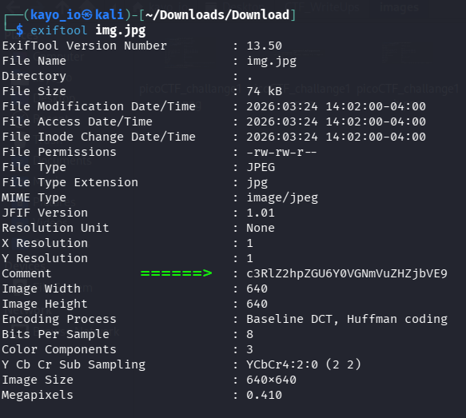
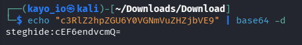
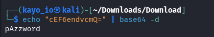
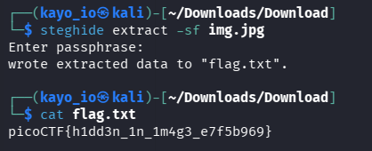

# PicoCTF - Hidden in plainsight  
## Description  

You’re given a seemingly ordinary JPG image. Something is tucked away out of sight inside the file. Your task is to discover the hidden payload and extract the flag.
---

## Initial Observation

The Image contained:
- The image looks like normal.    
- **Hints:**    
  - "Download the jpg image and read its metadata" 

This suggested the flag is hidden somewhere.

---

## Approach

### Step 1: Check Metadata:

**Result**: base64 text is hidden in the comment section.

### Step 2: Decode the string:

**Result**: It gave us another base64 text that looks like tha **pass phrase** for steghide.

### Step 3: Decode the pass phrase:

**Result**: Finally we get the real **Pass phrase**

### Step 4: The Final Step 

Now use **steghide** to extract:

**Discovery**

 * we got a text called **falg.txt** from the extracted image.
 * it contained the **flag**

#### Lessons Learned

* Don't depend only on one tool
* Search a solution everywhere you can 

#### Tools Used:  
   * cat - to read a text.   
   * exiftool - to see the Metadata  
   * steghide - to extract the image  
   * base64 - to decode base64 string

